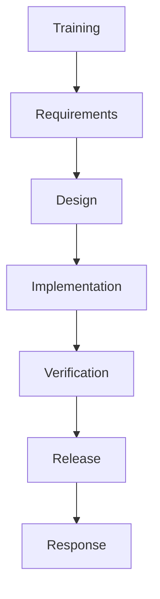

# Microsoft Security Development Lifecycle (SDL) Phases and Its Importance

In today’s world, software is used in banking, hospitals, education, and government systems. If software is not secure, attackers can steal data, damage systems, or misuse information.  

To avoid this, Microsoft introduced the **Security Development Lifecycle (SDL)**. It is a process that adds security practices to every stage of software development.

SDL ensures that security is not added at the end, but built into the software from the beginning.

---

# Phases of Microsoft Security Development Lifecycle (SDL)

The SDL contains the following main phases:

---

## 1. Training

- Developers and team members are trained in secure coding practices.
- They learn about common attacks like SQL Injection, XSS, etc.
- Ensures everyone understands security risks.

---

## 2. Requirements

- Security requirements are defined.
- Risk analysis is done.
- Security standards and policies are decided.

Example:
- Password must be encrypted.
- System must use HTTPS.

---

## 3. Design

- Secure architecture is planned.
- Threat modeling is performed.
- Possible threats are identified and solutions are planned.

Example:
- Identifying where attackers may enter the system.
- Planning authentication and authorization mechanisms.

---

## 4. Implementation (Coding)

- Developers write secure code.
- Follow secure coding guidelines.
- Avoid unsafe functions.
- Perform static code analysis to detect vulnerabilities.

---

## 5. Verification (Testing)

- Security testing is performed.
- Includes:
  - Code review
  - Penetration testing
  - Vulnerability scanning
- Ensures no major security flaws exist.

---

## 6. Release

- Final security review is done.
- Incident response plan is prepared.
- Documentation is completed.

---

## 7. Response

- After release, the system is monitored.
- If any vulnerability is found, patches are released.
- Continuous improvement is done.

---

# Neat Diagram of SDL Phases

This shows that SDL follows a structured and continuous process.

---

# Importance of SDL in Secure Software Development

1. **Reduces Security Vulnerabilities**
   - Finds issues early in development.
   - Prevents costly fixes later.

2. **Prevents Cyber Attacks**
   - Protects against SQL injection, XSS, malware attacks.

3. **Improves Software Quality**
   - Secure software is more reliable and stable.

4. **Saves Cost and Time**
   - Fixing bugs early is cheaper than after release.

5. **Builds User Trust**
   - Users feel safe sharing their data.

6. **Ensures Compliance**
   - Meets industry security standards.

---

# Conclusion

The Microsoft Security Development Lifecycle (SDL) is a structured approach to developing secure software. It includes phases like training, requirements, design, implementation, verification, release, and response.

By integrating security into every stage of development, SDL helps in building safe, reliable, and trustworthy software systems. Therefore, SDL is very important in modern secure software development.
