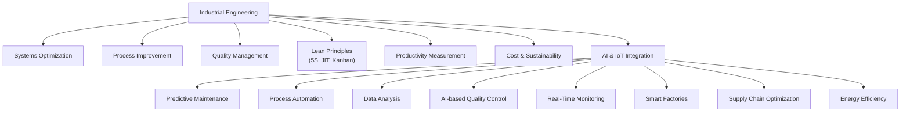

## 1. Explain the roles of Industrial Engineering in management and how AI and IoT transforms its applications.

### Role of Industrial Engineering

i. **Systems Optimization** - Optimize interactions.  
ii. **Process Improvement** - Streamline the workflow.  
iii. **Lean Principles** - Remove waste (5S, Kanban, and Just-in-Time)  
iv. **Quality Management** - Ensure quality (TQM, Six Sigma, and Statistical Process Control)  
v. **Work Design & Ergonomics** - Design systems for human safety & comfort.  
vi. **Productivity Measurement** - Analyze work efficiency (time study, work sampling etc.)  
vii. **Facility Layout** - Maximize space utilization.  
viii. **Cost Analysis** - Optimize financial decisions by reducing costs.  
ix. **Sustainability** - Reduce environmental impact.  

---

### AI and IoT Applications

#### AI Applications

- **Predictive Maintenance** - Predicts machine failures  
- **Process Automation** - Automates repetitive tasks  
- **Data Analysis** - Analyses large datasets  
- **Quality Control** - Detect defects in real-time  

#### IoT Applications

- **Real-Time Monitoring** - Track machine performance in real-time.  
- **Smart Factories** - Connects machines and systems and enables automation.  
- **Supply Chain Optimization** - Provides real-time data on inventory and logistics.  
- **Energy Efficiency** - Monitors energy usage  

---

### Examples

- Companies like Siemens use AI and IoT to predict machine failures, reducing downtime by 30%.  
- General Electric (GE) uses IoT to connect machines in its factories, improving efficiency and reducing costs.  

___

### Diagram

