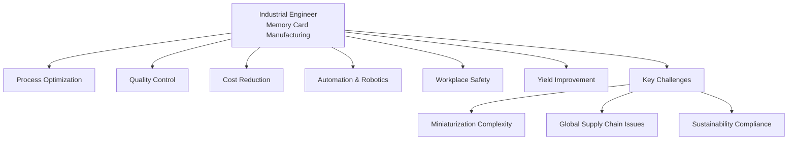

## 2. Explain the role of an Industrial Engineer in a memory card manufacturing company.

### Role of Industrial Engineering

i. **Systems Optimization** - Optimize interactions.  
ii. **Process Improvement** - Streamline the workflow.  
iii. **Lean Principles** - Remove waste (5S, Kanban, and Just-in-Time)  
iv. **Quality Management** - Ensure quality (TQM, Six Sigma, and Statistical Process Control)  
v. **Work Design & Ergonomics** - Design systems for human safety & comfort.  
vi. **Productivity Measurement** - Analyze work efficiency (time study, work sampling etc.)  
vii. **Facility Layout** - Maximize space utilization.  
viii. **Cost Analysis** - Optimize financial decisions by reducing costs.  
ix. **Sustainability** - Reduce environmental impact.  

---

### Role in a Memory Card Manufacturing Company

#### Key Factors

• **Process Optimization** - Improves production processes to make them more efficient.  
• **Quality Control** - Ensures memory cards meet high-quality standards.  
• **Cost Reduction** - Finds ways to reduce costs.  
• **Automation** - Introduces machines to reduce manual work.  
• **Workplace Safety** - Designs safe work environments.  

---

### Challenges

• **Miniaturization Complexity** - Memory card sizes shrink and require advanced micro-assembly techniques.  
• **Yield Improvement** - Addressing defects in semiconductor fabrication to ensure high yield rate.  
• **Global Supply Chain Issues** - Semiconductor shortages, logistics disruptions, and price fluctuations in raw materials.  
• **Sustainability Compliance** - Implementing eco-friendly manufacturing processes and adhere to environmental regulations and waste disposal norms.  

___

### Diagram

