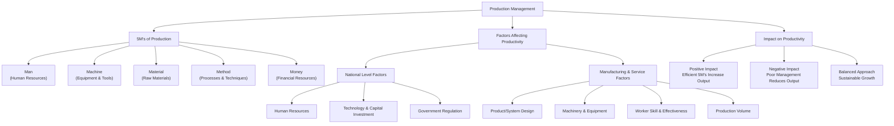

## 3. Describe the 5M's of production management and discuss the factors affecting overall productivity

### 5M's of Production Management

• **Man (Human Resources)** - Workforce involved in production.  
• **Machine (Equipment)** - Machinery and tools used in production.  
• **Material (Raw Materials)** - Raw materials and components used in production.  
• **Method (Processes)** - Techniques and procedures used in production.  
• **Money (Financial Resources)** - Financial resources available.  

---

### Factors Affecting Overall Productivity

#### (A) Factors Affecting National Productivity

• **Human Resources** – Skilled workforce enhances economic productivity.  
• **Technology and Capital Investment** – Advanced technology and infrastructure improve efficiency.  
• **Government Regulation** – Policies, taxation etc. impact productivity.  

#### (B) Factors Affecting Productivity in Manufacturing and Services

• **Product or System Design** – Well-designed products and processes reduce waste and enhance efficiency.  
• **Machinery and Equipment** – Well-maintained machines improve output.  
• **Skill and Effectiveness of the Worker** – Trained workforce increases efficiency.  
• **Production Volume** – Higher volumes reduces unit costs and improve productivity.  

---

### Impact Analysis

• **Positive Impact** - Skilled manpower, modern machinery, high-quality materials, efficient methods, and adequate capital increases productivity.  
• **Negative Impact** - Poor management of any of the 5M's lead to inefficiencies and decreases production.  
• **Balanced Approach** - Balanced focus on all 5M's ensures sustainable productivity growth.  

