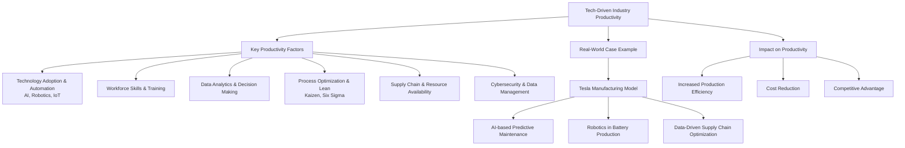

## 4. List and analyse factors affecting productivity in a tech-driven industry, with a real-world case example highlighting data analytics and process automation.

### Factors Affecting Overall Productivity

#### (A) Factors Affecting National Productivity

• **Human Resources**  
• **Technology and Capital Investment**  
• **Government Regulation**  

#### (B) Factors Affecting Productivity in Manufacturing and Services

• **Product or System Design**  
• **Machinery and Equipment**  
• **Skill and Effectiveness of the Worker**  
• **Production Volume**  

---

## Factors Affecting Productivity in a Tech-Driven Industry

• **Technology Adoption & Automation** – Use of AI, robotics and IoT to streamline operations and reduce manual intervention.  

• **Workforce Skills & Training** – Skilled employees capable of handling advanced machinery.  

• **Data Analytics & Decision-Making** – Real-time data insights to optimize supply chain.  

• **Process Optimization & Lean Manufacturing** – Continuous improvement (Kaizen, Six Sigma) to eliminate waste and improve workflow.  

• **Supply Chain & Resource Availability** – Ensuring uninterrupted flow of raw materials.  

• **Cybersecurity & Data Management** – Protecting sensitive information.  

---

## Case Example

### Tesla’s Use of Data Analytics & Process Automation

• Integrates data analytics and process automation across its manufacturing and supply chain.  

• Use AI-powered predictive maintenance to reduce machine downtime.  

• Implements robots for automation to improve battery production.  

---

## Impact Analysis

• Increased Production Efficiency  

• Cost Reduction  

• Competitive Advantage  

