## 5. Identify the factors to be considered while selecting the location for a sugar factory and explain how data analytics can help in the selection.

### Key Factors for Location Selection

i. **Availability of Raw Material** - Proximity to sugarcane farms reduces transportation costs and ensures a steady supply.  

ii. **Water Supply** - Reliable groundwater or river sources are essential due to high water requirements in sugar processing.  

iii. **Transportation & Logistics** - Good transport facilities enable easy movement of raw materials, finished sugar, and by-products.  

iv. **Power & Energy Availability** - A stable power supply is necessary, with many mills utilizing bagasse for self-support.  

v. **Labor Availability** - Skilled and unskilled labour should be easily accessible for smooth factory operations.  

vi. **Market Demand & Proximity to Consumers** - Close location to food and beverage industries reduces distribution costs.  

vii. **Environmental & Government Regulations** - Compliance with pollution norms, safety standards, and government policies is crucial.  

viii. **Climate & Soil Conditions** - Favourable climate and fertile soil support high sugarcane yield.  

ix. **Waste Disposal & By-product Utilization** - Efficient management of by-products like bagasse and molasses supports sustainability.  

x. **Land & Infrastructure Costs** - Affordable land with sufficient space for future expansion is vital.  

xi. **Risk & Disaster Management** - The site should be safe from floods, droughts, and natural disasters.  

---

## Role of Data Analytics in Location Selection

• **Demand Forecasting** - Analyzes historical consumption data to identify high-demand regions.  

• **Supply Chain Optimization** - Uses transportation and logistics data to minimize distribution costs.  

• **Geospatial Analysis (GIS)** - Maps sugarcane cultivation areas, water resources, and infrastructure facilities to identify optimal sites.  

• **Climate Data Analysis** - Evaluates rainfall, temperature, and soil data to predict sugarcane productivity.  

• **Cost-Benefit Analysis** - Compares land, labor, transport, and energy costs across multiple locations.  

• **Risk Assessment Models** - Uses historical disaster and weather data to assess flood and drought risks.  

• **Sustainability Analysis** - Monitors environmental impact and waste management feasibility using data-driven insights.  

• **Regulatory Compliance Tracking** - Analyzes local government policies, tax benefits, and industrial regulations.  

• **Scenario Simulation** - Runs predictive models to evaluate different location alternatives before final decision-making.  

```mermaid
flowchart TD

A["Sugar Factory Location Selection"]

A --> B["Key Location Factors"]

B --> B1["Raw Material Availability<br>Near Sugarcane Farms"]
B --> B2["Water Supply"]
B --> B3["Transport & Logistics"]
B --> B4["Power & Energy Availability"]
B --> B5["Labor Availability"]
B --> B6["Market Proximity"]
B --> B7["Environmental & Govt Regulations"]
B --> B8["Climate & Soil Conditions"]
B --> B9["Waste & By-product Utilization"]
B --> B10["Land & Infrastructure Cost"]
B --> B11["Risk & Disaster Management"]

A --> C["Role of Data Analytics"]

C --> C1["Demand Forecasting"]
C --> C2["Supply Chain Optimization"]
C --> C3["Geospatial Analysis (GIS)"]
C --> C4["Climate Data Analysis"]
C --> C5["Cost-Benefit Analysis"]
C --> C6["Risk Assessment Models"]
C --> C7["Sustainability Analysis"]
C --> C8["Regulatory Compliance Tracking"]
C --> C9["Scenario Simulation"]

A --> D["Outcome"]

D --> D1["Optimal Location Selection"]
D --> D2["Reduced Cost & Risk"]
D --> D3["Improved Sustainability & Profitability"]
```

